#   Design
##  Project
+   create

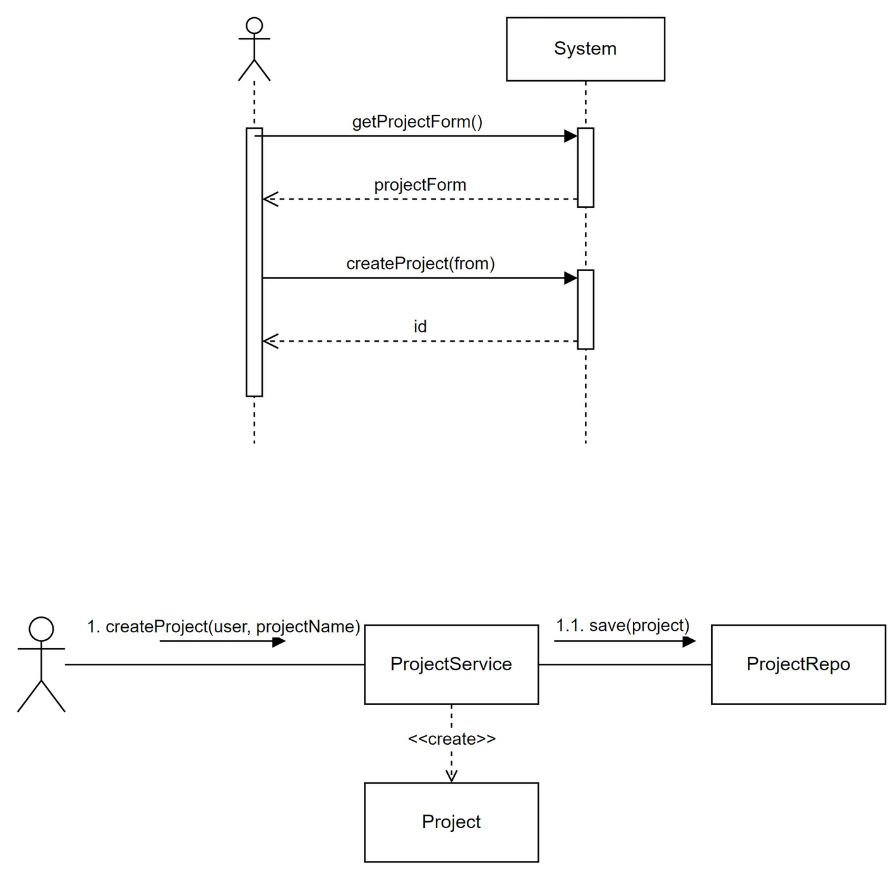

+ AddUser

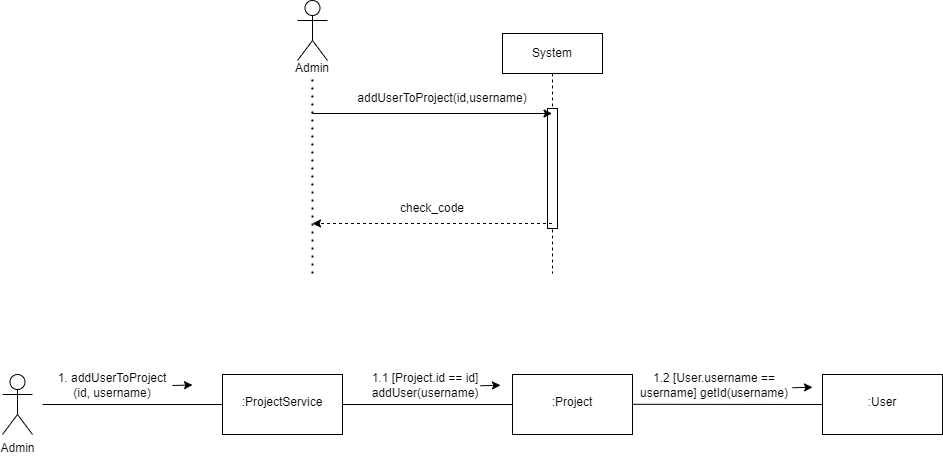

+ Find

##  Issue
+   create

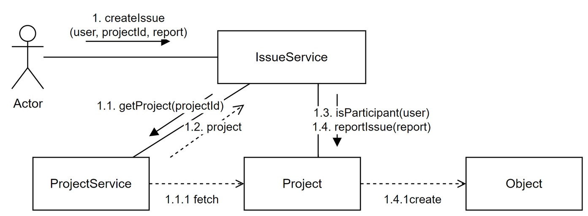

+  report

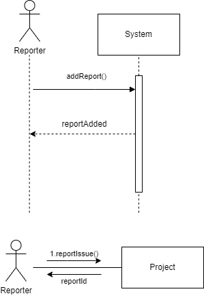

+  solve

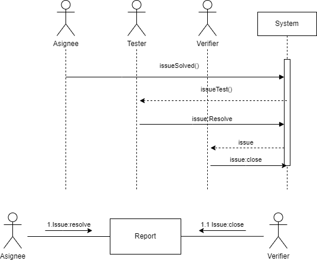

+  description

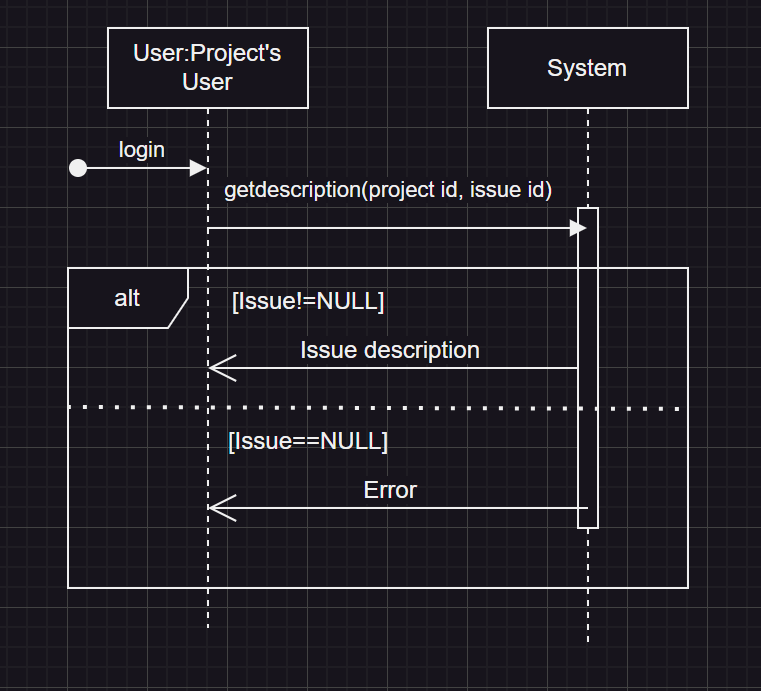

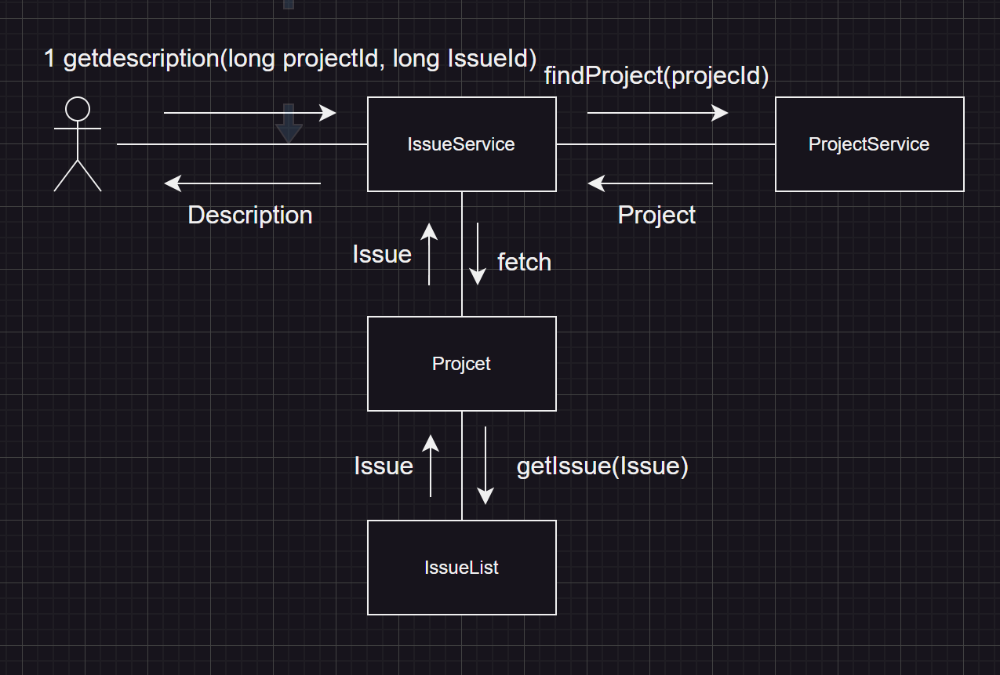

+ statistics

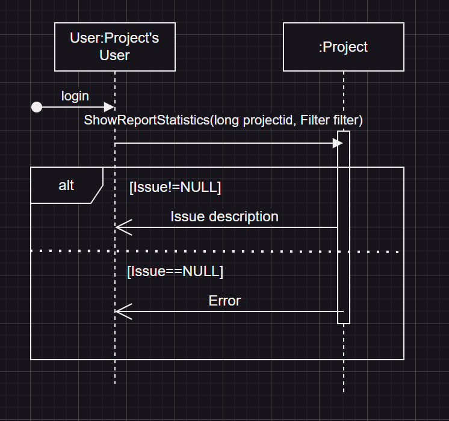

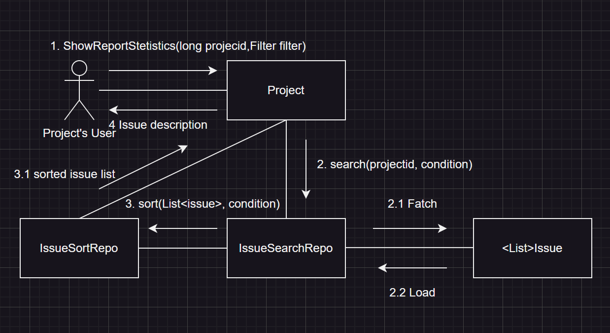

##  Comment
+   JPA의 도움으로, Project에 List<Comment> comments 필드를 넣고, comments.add()를 하면 자동으로 DB에 comment가 저장된다.

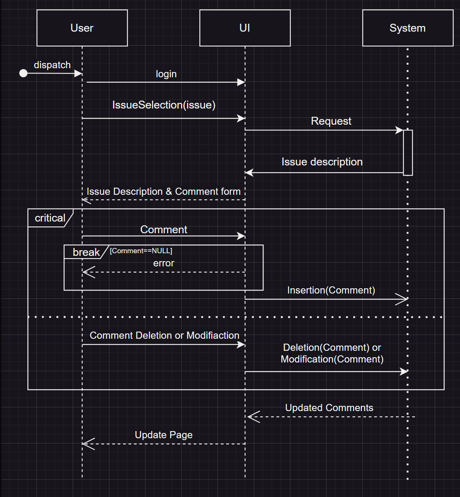

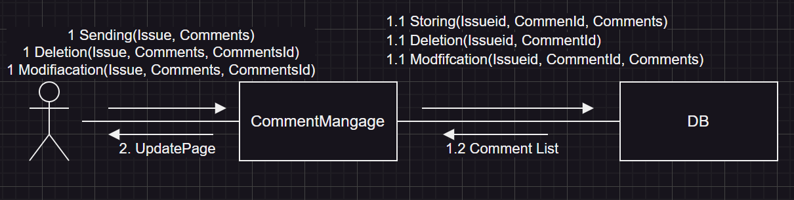
