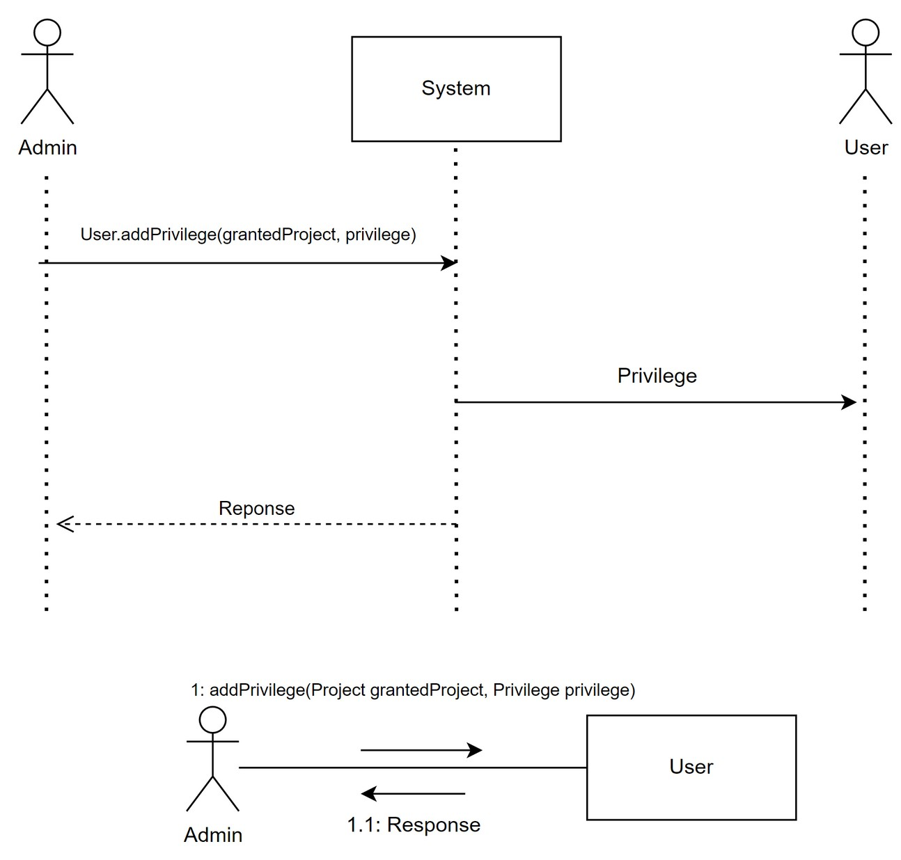
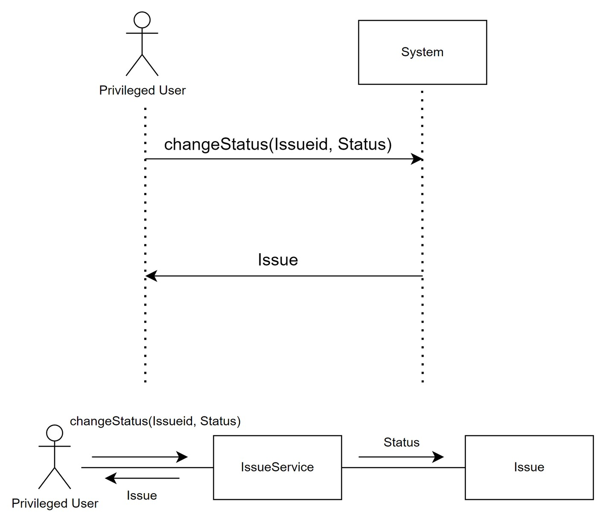
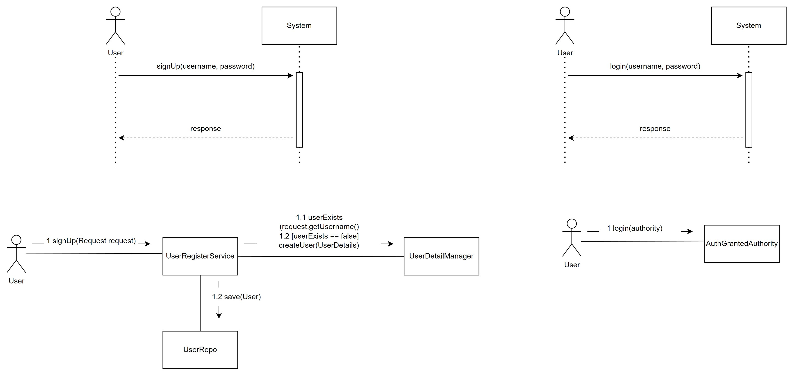
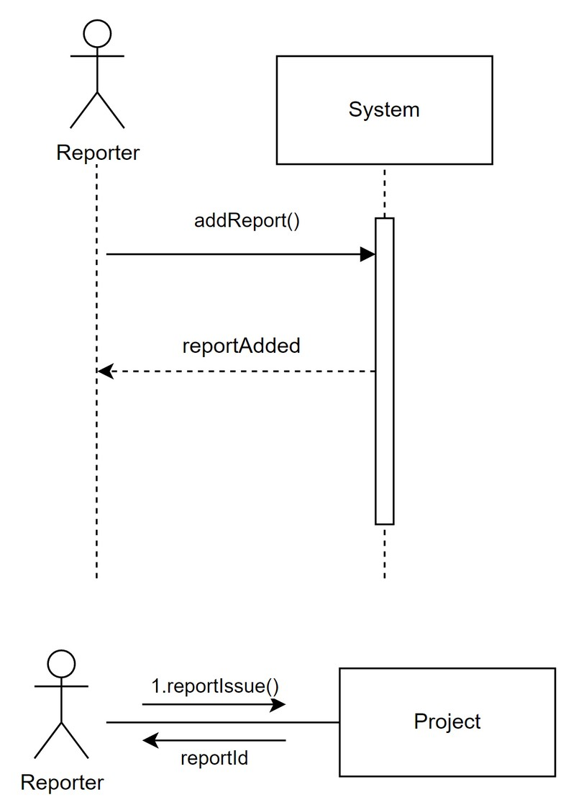
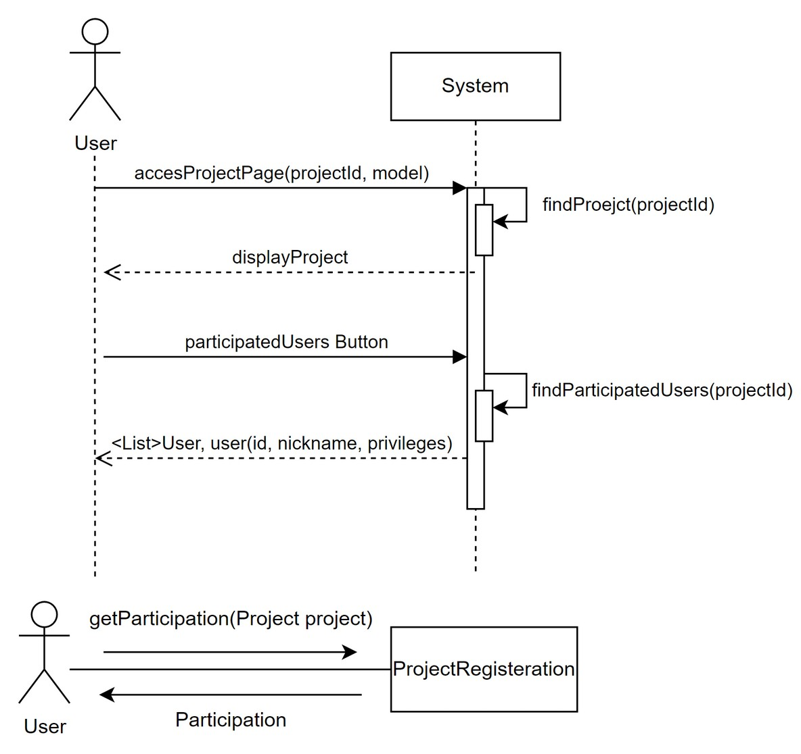

#   Design
## Privilege

+  Admin

+ change_status

##  Project

+  register_login

+   create

+ AddUser

+ Find

**Usecase 4번은 Usecase 5번의 Find 기능에서 Filter, Key를 전체값을 검색한다는 방식으로 extend된 기능입니다.**

##  Issue
+   create

+  report

+  solve

+  description

.png)

+ statistics

.png)

+ allocate_user_to_issue,_user_recommendation

##  Comment
+   JPA의 도움으로, Project에 List<Comment> comments 필드를 넣고, comments.add()를 하면 자동으로 DB에 comment가 저장된다.

.png)

## User

+  list

+  search

